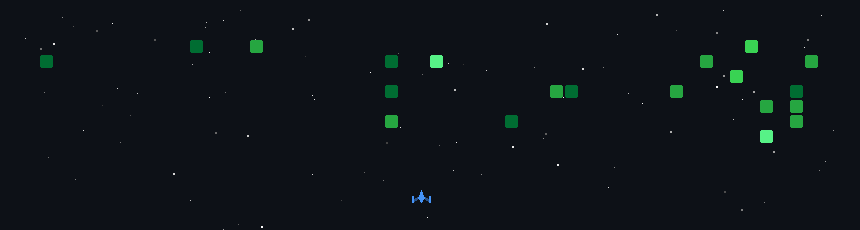

<h2 align="left">About Me</h2>

###

- Java Developer - C Develeper

###

<h2 align="left">Tecks</h2>

###

  
  
  
  
  
  
  

###

<h2 align="left">Stats</h2>

###

  
  
  

###

<h2 align="left">Social Media</h2>

###

  
  

###
